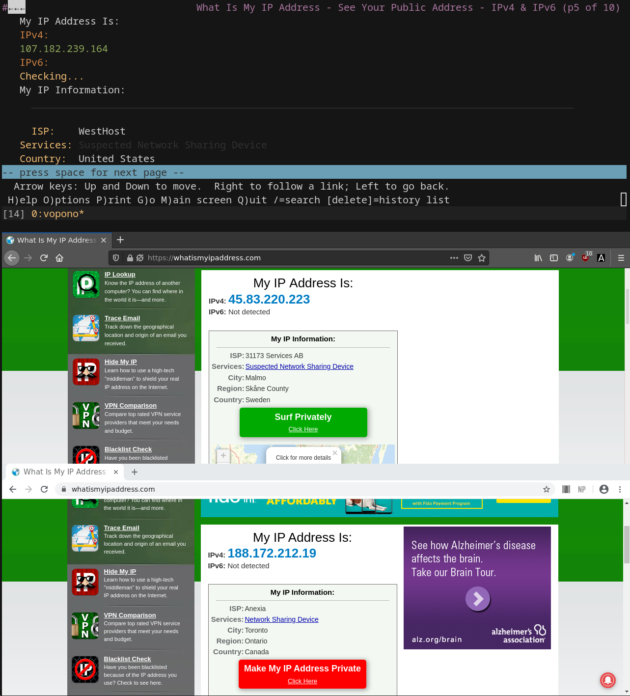
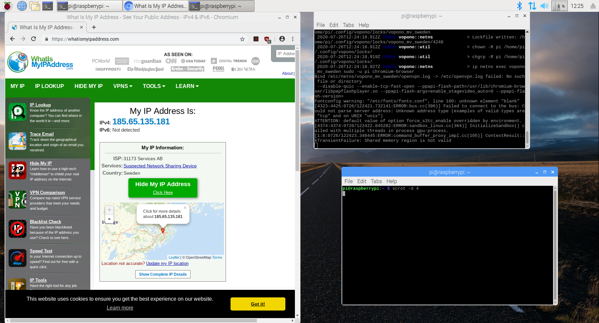

vopono is a tool to run applications through VPN tunnels via temporary
network namespaces. This allows you to run only a handful of
applications through different VPNs simultaneously, whilst keeping your main connection
as normal.

vopono includes built-in killswitches for both Wireguard and OpenVPN.

Currently Mullvad, AzireVPN, MozillaVPN, TigerVPN, ProtonVPN, iVPN,
NordVPN, and PrivateInternetAccess are supported directly, with custom
configuration files also supported with the `--custom` argument.

For custom connections the OpenConnect and OpenFortiVPN protocols are
also supported (e.g. for enterprise VPNs). See the [vopono User Guide](USERGUIDE.md) for more details.

## Screenshot

Screenshot showing an example with firefox, google-chrome-stable and
lynx all running through different VPN connections:



## Supported Providers

| Provider              | OpenVPN support | Wireguard support |
| --------------------- | --------------- | ----------------- |
| Mullvad               | ✅              | ✅                |
| AzireVPN              | ✅              | ✅                |
| iVPN                  | ✅              | ✅                |
| PrivateInternetAccess | ✅              | ❌                |
| TigerVPN              | ✅              | ❌                |
| ProtonVPN             | ✅              | ❌                |
| MozillaVPN            | ❌              | ✅                |
| NordVPN               | ✅              | ❌                |

## Usage

Set up VPN provider configuration files:

```bash
$ vopono sync
```

Run Firefox through an AzireVPN Wireguard connection to a server in
Norway:

```bash
$ vopono exec --provider azirevpn --server norway firefox
```

You should run vopono as your own user (not using sudo) as it will
handle privilege escalation where necessary. For more details around
running as a systemd service, etc. see the [User Guide](USERGUIDE.md).

vopono can handle up to 255 separate network namespaces (i.e. different VPN server
connections - if your VPN provider allows it). Commands launched with
the same server prefix and VPN provider will share the same network
namespace.

Default configuration options can be saved in the `~/.config/vopono/config.toml`
file, for example:

```toml
firewall = "NfTables"
provider = "Mullvad"
protocol = "Wireguard"
server = "usa-us22"
```

Note that the values are case-sensitive.

See the [vopono User Guide](USERGUIDE.md) for much more detailed usage instructions
(including handling daemons and servers).

## Installation

### AUR (Arch Linux)

Install the `vopono-git` package with your favourite AUR helper.

```bash
$ yay -S vopono-git
$ vopono sync
```

Alternatively use the `vopono-bin` package if you don't want to compile
from source.

### Raspberry Pi (Raspbian)

Download and install the `vopono_x.y.z_armhf.deb` package from the
releases page:

```bash
$ sudo dpkg -i vopono_0.2.1_armhf.deb
```

You will need to install OpenVPN (available in the Raspbian repos):

```bash
$ sudo apt install openvpn
```

You can then use vopono as above (note that the Chromium binary is
`chromium-browser`):

```bash
$ vopono sync --protocol openvpn mullvad
$ vopono exec --provider mullvad --server sweden chromium-browser
```

Screenshot of vopono with OpenVPN running on Raspbian:



Note Wireguard is not in the Raspbian repositories, so installing it is
not trivial. You can follow [this guide](https://www.sigmdel.ca/michel/ha/wireguard/wireguard_02_en.html) to attempt it, but note that
not only do you need to install Wireguard and `wireguard-tools` to have `wg`
available, but also the `linux-headers` to ensure it works correctly
(i.e. you don't just get `Protocol not supported` errors when trying to
establish a connection).

Check the [User Guide](USERGUIDE.md) for details on port forwarding and
using vopono with daemons and servers, in case you want to use your
Raspberry Pi to run privoxy or transmission-daemon, etc.

### Debian + Ubuntu

Install the deb package provided on the releases page.

### Fedora + OpenSUSE

Install the rpm package provided on the release page (choose the correct
version).

### Other Linux

Either use the compiled binaries on the release page, or install from
source with Cargo as documented below.

### From this repository (with Cargo)

Run the install script provided: `install.sh` - this will `cargo install` the repository and copy over the configuration files to
`~/.config/vopono/`

Note the minimum supported Rust version is 1.43. You can check your
version with:

```bash
$ rustc --version
```

## Known issues

- When launching a new application in an existing vopono namespace, any
  modifications to the firewall rules (i.e. forwarding and opening
  ports) will not be applied (they are only used when creating the
  namespace).
- OpenVPN credentials are always stored in plaintext in configuration - may add
  option to not store credentials, but it seems OpenVPN needs them
  provided in plaintext.
- There is no easy way to delete MozillaVPN devices (Wireguard
  keypairs) - unlike Mullvad this _cannot_ be done on the webpage. I recommend using [MozWire](https://github.com/NilsIrl/MozWire) to manage this.
- `gnome-terminal` will not run in the network namespace due to the
  client-server model - see issue [#48](https://github.com/jamesmcm/vopono/issues/48)

## License

vopono is licensed under the GPL Version 3.0 (or above), see the LICENSE
file or https://www.gnu.org/licenses/gpl-3.0.en.html

## Etymology

vopono is the pronunciation of the letters VPN in Esperanto.

Se vi ankaŭ parolas Esperanton, bonvolu serĉi min en la kanalo de
Discord de Rust Programming Language Community.

## Contribution

Unless you explicitly state otherwise, any contribution intentionally submitted
for inclusion in the work by you, will be licensed under the GPLv3 (or
above), without any additional terms or conditions.

Many thanks to NilIrl's [MozWire](https://github.com/NilsIrl/MozWire)
for the investigation of the MozillaVPN API.
