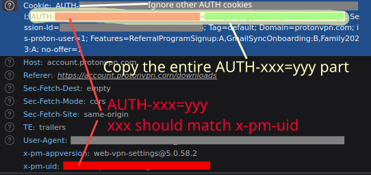

# vopono User Guide

## asciinema example

[](https://asciinema.org/a/369367)

## Usage

Applications will be run as the current user by default (you can use
`vopono exec sudo -u USERNAME program` as the command to run as another user).

vopono will call sudo if required, it is recommended to run as the
current user and let vopono call sudo so that the configuration
directories are correctly inferred and the final command is not run as
root.

Note that child processes of the application will also be spawned inside
the network namespace and so use the same VPN connection, so you can run
entire shell sessions inside vopono.

Note that the order of command-line arguments matters, as the `--dns`
argument can take a list of DNS servers for example.

### Daemon mode (recommended)

vopono now supports a persistent root daemon that handles all privileged work. Run the daemon as root, and keep using `vopono` as your normal user. The CLI forwards `exec` requests to the daemon automatically when it’s available; if not, it falls back to `sudo`.

- Start once at boot (systemd): `sudo systemctl enable --now vopono-daemon`
- Or run manually: `sudo vopono daemon`
- Then run apps as your user: `vopono exec --provider mullvad --server sweden firefox`

Signals (e.g., Ctrl+C, Ctrl+Z) and interactive TTY behavior work cleanly via the daemon. The daemon listens on `/run/vopono.sock` and cleans it up on exit.

Example systemd unit for the root daemon (`/etc/systemd/system/vopono-daemon.service`):

```
[Unit]
Description=Vopono root daemon
After=network.target
Requires=network.target

[Service]
Type=simple
ExecStart=/usr/bin/vopono daemon
Restart=on-failure
RestartSec=2s
# Optional: enable structured logs
Environment=RUST_LOG=info

[Install]
WantedBy=multi-user.target
```

Check status and logs:

```
sudo systemctl status vopono-daemon
sudo journalctl -u vopono-daemon -e
```

Note there is a known issue that when using tmux, etc. - sometimes the
original shell will not recover correctly upon terminating the
application run with daemon mode.

### Creating only Network Namespace

You can run vopono to create only the network namespace using the
`--create-netns-only` argument, the application related arguments are
then ignored (pass anything as the application name). This can be useful
for debugging connection issues.

This can also be used to launch an application without sudo via firejail
- e.g. (where `none` is passed as the dummy application):

```bash
$ vopono -v exec --provider protonvpn --server japan --protocol openvpn --create-netns-only none
2023-11-26T11:17:52.623Z INFO  vopono::exec > Created netns vo_pr_japan - will leave network namespace alive until ctrl+C received
$ firejail --netns=vo_pr_japan firefox-developer-edition
```

### Using vopono inside a Wireguard tunnel

You can use the above to run vopono inside an existing Wireguard tunnel.

e.g. first run the Wireguard client on the host (here the Wireguard
interface will be `foo`):

```sh
$ sudo wg-quick up ./foo.conf
```

Then use vopono to create a network namespace, and run bash inside to
execute your internal VPN command. Note the `-i foo` which tells vopono
to use the Wireguard interface for connecting the network namespace!

```sh
$ vopono -v exec --create-netns-only --provider None --protocol None --server None -i foo bash
$ sudo ip netns exec vo_none_None bash
$ ./vpn.sh
```

Note you can set config files in `/etc/netns/vo_none_None/` to have them
apply only in the network namespace e.g.:

```sh
$ bat -p /etc/netns/vo_none_None/resolv.conf
search xxx
nameserver a.b.c.d

$ bat -p /etc/netns/vo_none_None/gai.conf
# Prefer IPv4 over IPv6
precedence ::ffff:0:0/96 100
scopev4 ::ffff:169.254.0.0/112  2
scopev4 ::ffff:127.0.0.0/104    2
scopev4 ::ffff:0.0.0.0/96       14
```

But be careful in the order in which you set the DNS server e.g. if it
is internal to your second VPN connection you will first want to
connect, and then set it.

Finally you can run an application inside the network namespace (or use
vopono to do so - vopono will use the existing namespace).

```sh
$ sudo -E ip netns exec vo_none_None sudo --preserve-env --user archie google-chrome-stable
# or equivalently with vopono:
$ vopono -v exec --protocol None --provider None --server None google-chrome-stable
```

### Configuration file

You can save default configuration options in the config file
`~/.config/vopono/config.toml` (or in the respective `$XDG_CONFIG/vopono/`
directory).

Here is an example:

```toml
firewall = "NfTables"
provider = "Mullvad"
protocol = "Wireguard"
server = "usa-us22"
postup = "/home/archie/postup.sh"
predown = "/home/archie/predown.sh"
user = "archie"
dns = "8.8.8.8"
# custom_config = "/home/user/vpn/mycustomconfig.ovpn"
```

Note that the values are case-sensitive. If you use a custom config file
then you should not set the provider or server (setting the protocol is
also optional).

### PostUp and PreDown scripts - run on Host (outside network namespace)

vopono can run scripts on the host machine (outside the network namespace) with the `--postup` and `--predown` arguments (or set in the `~/.config/vopono/config.toml` file). The postup script will run right after the network namespace is set up (also after provider port forwarding if used), the postdown script will run when tearing down the network namespace after the target application has terminated.

These scripts run outside of the network namespace so that they can be used to run proxies and DNS services which the network namespace can use. To run extra commands within the network namespace, you can just wrap the target command with your own script (see the Plex example below).

These scripts run using the current working directory with the same user as the target application itself (which can be set
with the `user` argument or config file entry).

Arguments can be passed to the scripts from the command line (note the escaped spaces if the script path contains spaces), e.g.:

```bash
--postup "~/test\ postup.sh argy1 argy2"
```

e.g. with a script like:

```bash
#!/bin/bash
echo "arg1: $1 arg2: $2"
```

Just like for the target application execution, the following environment variables are available (but recall that these scripts run *outside* the network namespace):

- `$VOPONO_HOST_IP` the local IP address of the host machine as seen from inside the network namespace.
- `$VOPONO_NS_IP` the local IP address of the network namespace as seen from the host.
- `$VOPONO_NS` the name of the network namespace.
- `$VOPONO_FORWARDED_PORT` the forwarded port for provider port forwarding (ProtonVPN or PIA) - only when using `--port-forwarding` or `--custom-port-forwarding`

`$VOPONO_NS_IP` is useful if you'd like to configure a server
running within the network namespace to listen on its local IP address only
(see below for more information on that).

### Host access from within the network namespace

The host IP address (as seen from inside the network namespace) is provided as the
`$VOPONO_HOST_IP` environment variable to the target application/script itself (and also the host scripts described above).

If `--allow-host-access` is set then the host machine IP (as seen from the network namespace) is also added to the hosts file as `vopono.host` so you can access services on the host machine from within the network namespace e.g. at `http://vopono.host:8080` etc.

If provider port forwarding is enabled (e.g. `--port-forwarding` or `--custom-port-forwarding` with ProtonVPN or PIA) then the forwarded port is provided as `$VOPONO_FORWARDED_PORT`.

### Running commands before and after execution within the network namespace

To run extra commands inside the network namespace you can wrap your target application with a bash script and provide that script as the target to vopono.

Note that the target user *must* have read and executable access to this script!

For example with a simple script using the environment variables (also see the Plex section below):

```bash
#!/bin/bash

echo "=> NETWORK NAMESPACE IP: $VOPONO_NS_IP"
echo "=> HOST IP: $VOPONO_HOST_IP"
```

Execution: `vopono exec {other Vopono options} '/path/to/the/above/script.sh'`

Output:

```
=> NETWORK NAMESPACE IP: 10.200.1.2
=> HOST IP: 10.200.1.1
```

### Wireguard

Install vopono and use `vopono sync` to
create the Wireguard configuration files (and generate a keypair if
necessary):

```bash
$ paru -S vopono-bin
$ vopono sync --protocol wireguard
```

Run vopono:

```bash
$ vopono exec --provider mullvad --server sweden --protocol wireguard "transmission-gtk"
```

The server prefix will be searched against available servers (and
country names) and a random one will be chosen (and reported in the terminal).

Note that vopono expects the `AllowedIPs` setting to allow all traffic,
since all traffic in the vopono network namespace will be forced through
this tunnel (traffic via the host is deliberately blocked to enforce the
killswitch). e.g. it should be `AllowedIPs = 0.0.0.0/0,::/0`

#### Custom Settings

The sync menu will prompt you for any custom settings (i.e. ports used,
and connection protocol for OpenVPN, etc.)

Valid ports for Mullvad Wireguard are: 53, 4000-33433, 33565-51820 and 52000-60000.
The same is true for MozillaVPN since it is mostly a wrapper around Mullvad's
Wireguard services.

### OpenVPN

Install vopono and use `vopono sync` to
create the OpenVPN configuration files and server lists.

```bash
$ paru -S vopono-bin
$ vopono sync --protocol openvpn
```

Run vopono:

```bash
$ vopono exec --provider privateinternetaccess --server poland "curl ifconfig.co/country"
Poland
```

You can also launch graphical applications like `firefox`,
`transmission-gtk`, etc. - the network namespace will be cleaned up when
the application is terminated. Note you may need to run them as your own
user:

```bash
$ vopono exec --provider privateinternetaccess --server mexico "firefox"
```

The server prefix will be searched against available servers (both
server names and aliases in the provider's configuration files) and a
random one will be chosen (and reported in the terminal).

The sync process will save your credentials to a file in the
config directory of the provider, so it can be passed to OpenVPN.
If it is missing you will be prompted for your credentials.

For PrivateInternetAccess these should be the same as your account
credentials.

For Mullvad your OpenVPN credentials are your account code as your username, and `m` as the password.

For ProtonVPN you can view your OpenVPN credentials [online on your account dashboard](https://account.protonvpn.com/account#openvpn).
The OpenVPN credentials are **not** the same as your ProtonVPN account credentials.

For AirVPN the OpenVPN connection uses a key embedded in the config
files, however you will need to provide your AirVPN API key and enable
API access in [the client area webpage](https://airvpn.org/apisettings/) when running `vopono sync`.
Note that ports for forwarding must also be added in [the client area webpage](https://airvpn.org/ports/), 
and it is also possible to configure the VPN tunnel [DNS settings there](https://airvpn.org/dns/).

#### Connection / hostname resolution issues

If you face issues with OpenVPN resolving the remote host, try generating the VPN provider config files with IP addresses instead.

e.g. the error may appear as follows:

```
2023-01-06 13:19:18 RESOLVE: Cannot resolve host address: ro-buh-ovpn-002.mullvad.net:1197 (Name or service not known)
```

#### TCP support and custom ports

By default vopono uses the UDP configuration of the VPN providers.

You can use the TCP configurations by running `vopono sync` and choosing
that option from the provider configuration.

For Mullvad, valid ports are: 1300, 1301, 1302, 1194, 1195, 1196, 1197, or 53 for UDP, and
80 or 443 for TCP,

For PrivateInternetAccess valid ports are 1198 for UDP and 502 for TCP.

#### Shadowsocks socks-proxy

Mullvad supports proxying via Shadowsocks, if that configuration is
chosen with `vopono sync`. Note you must use a TCP connection on port
443 in this case.

Respond with `Y` when asked `Connect via a bridge?` during the `vopono sync` configuration for Mullvad OpenVPN to enable this configuration. It
is not used by default.

If you are using a custom provider config file, you must run the socks
proxy server yourself (i.e. `ss-local`) if using a socks-proxy.

### Custom Providers

If you use another commercial VPN provider, please open a Pull Request here with
the necessary configuration and serverlist.

For private VPN connections, you can use a custom provider, by passing
the complete configuration file to vopono (i.e. an OpenVPN .ovpn config
file or a Wireguard wg-quick .conf file).

```bash
$ vopono -v exec --custom ~/custom_wireguard.conf --protocol wireguard "firefox"
```

```bash
$ vopono -v exec --custom ./custom_openvpn.ovpn --protocol openvpn "firefox"
```
To use a custom provider which requires a username and password, supply an authentication file with the username and password.
Reference the authentication file in the ovpn configuration file with `auth-user-pass auth.txt` appended to the top of the file.

Note that in the OpenVPN case the vopono will execute OpenVPN from the same
directory as the config file itself. So any accompanying files (CA certificates, authentication
files, etc.) must be in the same directory with the file if using
relative paths in the config file.

For OpenVPN be careful to remove any DNS update scripts from the OpenVPN config file e.g. for ProtonVPN OpenVPN configs, remove the following lines:

```
up /etc/openvpn/update-resolv-conf
down /etc/openvpn/update-resolv-conf
```


### OpenFortiVPN

OpenFortiVPN is supported as a custom provider, allowing you to connect
to Fortinet VPN servers.

To use it, first create an [OpenFortiVPN](https://github.com/adrienverge/openfortivpn) config file for your
connection, such as:

`myvpn.conf`:
```
host = vpn.company.net
port = 443
username = myuser
password = mypassword
set-dns = 0
pppd-use-peerdns = 0
pppd-log = /tmp/pppd.log
```

You must set `set-dns` and `pppd-use-peerdns` to `0` so that
OpenFortiVPN does not try to change the global DNS settings (vopono will
set them within the network namespace). You __must__ include the line:
`pppd-log = /tmp/pppd.log` as vopono uses this to read the pppd output
directly.

Then run vopono using this as the custom config file and specifying
`OpenFortiVPN` as the protocol. Note that if you do not specify your
password in the OpenFortiVPN config file then you must enter it when it
is waiting to connect (you will not be prompted).

```bash
vopono -v exec --protocol OpenFortiVPN --custom /home/user/myvpn.conf firefox
```

### Firefox

Note if running multiple Firefox sessions, they need to run separate
profiles in order to force Firefox to run them as separate processes.

Trying to run Firefox normally when there is already an instance running
will result in a silent error.

You should also disable DNS over HTTPS as this will send all DNS
requests to Cloudflare by default. Firefox Options > General >
Network settings > Settings, then deselect `Enable DNS over HTTPS`.

You may also wish to disable WebRTC - see
[Mullvad's guide](https://mullvad.net/en/help/webrtc/) for more details.

Similar issues apply to Chromium and Google Chrome, where you must provide a 
different `user-data-dir` in order to force it to use a separate process:

```bash
$ chromium --user-data-dir=/tmp/profile-2
```

### Daemons and servers

If running servers and daemons inside of vopono, you can you use the
`-f $PORT` argument to allow incoming connections to a TCP port inside the namespace, by default this
port will also be proxied to your host machine at the same port number.
Note for same daemons you may need to use the `-k` keep-alive option in
case the process ID changes (you will then need to manually kill the
daemon after finishing).

If you need to allow multiple incoming connections to TCP ports inside the namespace, you can specify multiple `-f $PORT` arguments. For example if you wanted to allow ports 8080, 8081 and 8082:

```bash
$ vopono -v exec -k -f 8080 -f 8081 -f 8082 --provider azirevpn --server norway "program_a -flag"
```

Note that this will only work on the first call to create the network namespace in question.

#### Starting further programs with vopono using an existing network namespace

Let's say you've already ran

```bash
$ vopono -v exec -k -f 8080 -f 8081 --provider azirevpn --server norway "program_a -flag"
```
where `program_a` is accessible over port 8080. Now if you want to add another program `program_b` which will be accessible over port 8081, and ensure it uses the same VPN tunnel, you can simply specify the same server (or custom config):

```bash
$ vopono -v exec -k --provider azirevpn --server norway "program_b -flag"
```

This will bind `program_b` to the existing network namespace used for `program_a` which already has the necessary port for `program_b` specified at creation of the network namespace.

#### transmission-daemon

For example, to launch `transmission-daemon` that is externally
accessible at `127.0.0.1:9091` (with outward connections via AzireVPN with Wireguard and a VPN server in Norway):

```bash
$ vopono -v exec -k -f 9091 --provider azirevpn --server norway "transmission-daemon -a *.*.*.*"
```

Note in the case of `transmission-daemon` the `-a *.*.*.*` argument is
required to allow external connections to the daemon's web portal (your
host machine will now count as external to the network namespace).

Instead of listening on `*.*.*.*` you also can listen on `$VOPONO_NS_IP`,
to listen on an IP address that is only reachable from the same machine,
the network namespace runs on.

When finished with vopono, you must manually kill the
`transmission-daemon` since the PID changes (i.e. use `killall`).

#### Jackett

The same approach also works for [Jackett](https://github.com/Jackett/Jackett), e.g. with the setup from
the [AUR PKGBUILD](https://aur.archlinux.org/packages/jackett-bin) (a separate `jackett` user and hosting on port `9117`):

```bash
$ vopono -v exec -u jackett "/usr/lib/jackett/jackett --NoRestart --NoUpdates --DataFolder /var/lib/jackett" -f 9117
```

You can then access the web UI on the host machine at `http://127.0.0.1:9117/UI/Dashboard`, but all of Jackett's connections will go via the VPN.

#### Plex - port forwarding

Plex can be run and port forwarded (for Internet accessibility) with the following command and bash script.

Note this assumes a standard Arch Linux plex-media-server installation (i.e. where Plex uses its own `plex` user).

In `/home/plex/plex_launch.sh`:
```bash
#!/bin/bash
# Plex config env vars
export LD_LIBRARY_PATH=/usr/lib/plexmediaserver/lib
export PLEX_MEDIA_SERVER_HOME=/usr/lib/plexmediaserver
export PLEX_MEDIA_SERVER_APPLICATION_SUPPORT_DIR=/var/lib/plex
export PLEX_MEDIA_SERVER_MAX_PLUGIN_PROCS=6
export PLEX_MEDIA_SERVER_TMPDIR=/tmp
export TMPDIR=/tmp

PLEX_LOCAL_PORT=32400  # Seems this is hardcoded in Plex
# local address will only be accesible if running vopono with -o 32400
echo "local Plex address: http://$VOPONO_NS_IP:$PLEX_LOCAL_PORT"
# This assume using --port-forwarding or --custom-port-forwarding for ProtonVPN or PIA
echo "remote Plex address: http://$(curl -4s ifconfig.co):$VOPONO_FORWARDED_PORT"
# Here we redirect incoming connections on the forwarded to the port to the local Plex one (since we cannot change it! unlike transmission-gtk etc.)
# Run this in background as it would block
socat tcp-l:"$VOPONO_FORWARDED_PORT",fork,reuseaddr tcp:"$VOPONO_NS_IP":"$PLEX_LOCAL_PORT" &

/usr/lib/plexmediaserver/Plex\ Media\ Server
# Kill socat background process on termination
kill %1
```

The `plex` user must have access to the above script, e.g.:
```bash
sudo chown -R plex /home/plex/
sudo chmod 777 /home/plex/plex_launch.sh
```

Launch vopono with the following command (e.g. here with a ProtonVPN custom Wireguard config):

```bash
$ vopono exec --user plex --custom ~/Downloads/protonvpn-RO-9.conf --protocol wireguard --provider custom --custom-port-forwarding protonvpn -o 32400 /home/plex/plex_launch.sh
```

Note the `-o 32400` is necessary to have local access to the Plex server from the host, which can be very useful for debugging.


#### Proxy to host

By default, vopono runs a small TCP proxy to proxy the ports on your
host machine to the ports on the network namespace - if you do not want
this to run use the `--no-proxy` flag.

In this case, you can read the IP of the network namespace from the
terminal, or use `$VOPONO_NS_IP` to get it (e.g. to use it in a script).

#### systemd service

If you want to keep a single daemon or server app running under vopono without using the root daemon above, you can still use a user service (requires passwordless sudo for the commands vopono escalates). For example:

`/etc/systemd/user/vopono.service`:
```
[Service]
ExecStart=/usr/bin/vopono -v exec -k -f 9091 --protocol wireguard --provider mullvad --server romania "transmission-daemon -a *.*.*.*"
```

And then start it with (no sudo):
```
systemctl start --user vopono
```

If you do not have passwordless sudo access, prefer the root daemon approach above (`vopono-daemon`) and keep using `vopono exec` as your user.

#### Privoxy

A popular use case is to run a proxy server like Privoxy inside the
namespace with vopono, and then just configure Firefox, etc. to use that
(so it connects via the VPN). This saves having to use Docker or LXC,
etc. to do this otherwise.

Here is an example using AzireVPN and Wireguard (where the privoxy user
was already created in the normal installation process):

```bash
$ vopono -v exec --provider azirevpn -k -u root -f 8118 --server norway  "privoxy --chroot --user privoxy /etc/privoxy/config"
```

Note we need to specify `-u root` so that privoxy has the permissions to
chroot later.

Port 8118 is then forwarded to the local host, so you can use the proxy
server normal. Note that just like with the transmission-daemon example
above, Privoxy **must** be configured to allow remote connections,
specifically in the config file you must **not** specify an IP address in
the `listen-address`:

```
listen-address :8118
```

Note that since the daemon forks to a new PID and does not set the
parent PID, you must use the `-k` option to keep vopono alive and then
manually kill Privoxy when finished with `sudo killall privoxy`.

If you have a better solution for handling the PIDs of daemons please
create an issue / Pull Request!

### Listing running namespaces and applications

The `vopono list` command lists running applications and namespaces, as
a tab separated table:

```bash
$ vopono list namespaces
namespace       provider        protocol        num_applications        uptime
vopono_tig_us_losangeles        TigerVpn        OpenVpn 2       28s

$ vopono list applications
namespace       provider        protocol        application     uptime
vopono_tig_us_losangeles        TigerVpn        OpenVpn firefox 36s
vopono_tig_us_losangeles        TigerVpn        OpenVpn lynx    15s
```

### Listing possible servers

The `--server` argument is actually a prefix,
and you can see all possibilities for a given prefix and provider with:

```bash
$ vopono servers mullvad --prefix usa
provider        protocol        config_file
Mullvad openvpn usa-us.ovpn
Mullvad wireguard       usa-us40.conf
Mullvad wireguard       usa-us145.conf
Mullvad wireguard       usa-us52.conf
...
```

## Censorship evasion

Some countries / ISPs have heavier censorship using Deep Packet Inspection, etc. to block Wireguard connections - or even dropping all UDP traffic entirely, etc. - there are many tools to deal with this. vopono currently has built-in support for [Trojan](https://trojan-gfw.github.io/trojan/), while [udp2raw](https://github.com/wangyu-/udp2raw) is also easy to run with a custom script.

### Trojan

[Trojan](https://trojan-gfw.github.io/trojan/) can be used for Wireguard forwarding with the `--trojan*` options in vopono:

```
--trojan-host <TROJAN_HOST>
    Trojan server address - hostname or IP, will not verify SSL if IP address is given. Port is optional (default is 443)
--trojan-password <TROJAN_PASSWORD>
    Trojan server password Set this in ~/.config/vopono/vopono.toml or use --trojan-config to avoid setting this in the command line
--trojan-no-verify
    Disable SSL verification for Trojan server
--trojan-config <TROJAN_CONFIG>
    Trojan config file (will override other settings)
```

Standard Wireguard forwarding example:

```sh
$ vopono -v exec --protocol wireguard --custom ~/AirVPN_Czech-Republic_UDP-1637-Entry3.conf --trojan-host your_trojan_domain.xyz --trojan-password your_trojan_password firefox-developer-edition
```

Note you can use the `~/.config/vopono/vopono.toml` file to store your password or provide a custom Trojan config JSON to avoid passing it on the command line.

Custom Trojan JSON example:

```sh
$ vopono -v exec --protocol wireguard --custom ~/AirVPN_Czech-Republic_UDP-1637-Entry3.conf --trojan-config ~/forward.json firefox-developer-edition
```

Where `forward.json` is a valid Trojan configuration for your Trojan server:
```json
{
    "run_type": "forward",
    "local_addr": "127.0.0.1",
    "local_port": 1637,
    "remote_addr": "yourdomain.xyz",
    "remote_port": 443,
    "target_addr": "wireguard_endpoint",
    "target_port": 1637,
    "password": [
        "password1"
    ],
    "udp_timeout": 60,
    "log_level": 1,
    "ssl": {
        "verify": true,
        "verify_hostname": true,
        "cert": "/home/archie/trojancert.crt",
        "cipher": "ECDHE-ECDSA-AES128-GCM-SHA256:ECDHE-RSA-AES128-GCM-SHA256:ECDHE-ECDSA-CHACHA20-POLY1305:ECDHE-RSA-CHACHA20-POLY1305:ECDHE-ECDSA-AES256-GCM-SHA384:ECDHE-RSA-AES256-GCM-SHA384:ECDHE-ECDSA-AES256-SHA:ECDHE-ECDSA-AES128-SHA:ECDHE-RSA-AES128-SHA:ECDHE-RSA-AES256-SHA:DHE-RSA-AES128-SHA:DHE-RSA-AES256-SHA:AES128-SHA:AES256-SHA:DES-CBC3-SHA",
        "cipher_tls13": "TLS_AES_128_GCM_SHA256:TLS_CHACHA20_POLY1305_SHA256:TLS_AES_256_GCM_SHA384",
        "sni": "yourdomain.xyz",
        "alpn": [
            "h2",
            "http/1.1"
        ],
        "reuse_session": true,
        "session_ticket": false,
        "curves": ""
    },
    "tcp": {
        "no_delay": true,
        "keep_alive": true,
        "reuse_port": false,
        "fast_open": false,
        "fast_open_qlen": 20
    }
}

```

Note you can get the certificate for your domain (for the JSON config) manually using Trojan's [getcert.py](https://github.com/trojan-gfw/trojan/blob/master/scripts/getcert.py). vopono will do this automatically if you don't use a custom Trojan config JSON.

Only Wireguard forwarding is supported at the moment. Transparent proxying without a VPN service is not supported.

See [issue #291](https://github.com/jamesmcm/vopono/issues/291) for discussion of Trojan support.

### udp2raw

udp2raw can also be used for Wireguard forwarding, however unlike Trojan, your server must be manually configured to set the desired target Wireguard endpoint (e.g. of your VPN provider). udp2raw cannot have this set by the client on connection like Trojan, it must be hard-coded in the server config.

Client usage:
```sh
vopono -v exec --open-hosts $UDP2RAWHOST --protocol wireguard --custom ~/airvpn_udp2raw.conf "~/udp2rawtest.sh"
```

udp2rawtest.sh:
```sh
#!/bin/sh
# Run this with:
# vopono -v exec --open-hosts $REMOTE --protocol wireguard --custom ~/wg_conf_with_localhost.conf "~/udp2rawtest.sh appname"

# Address for remote udp2raw server
# Change this!
REMOTE="UDP2RAWHOST"
RPORT="58998"
KEY="passwd"

# Set this Wireguard peer in the Wireguard config
# But remember to set the real destination
# address and port on the udp2raw server
WIREGUARD_PEER="127.0.0.1:1637"

# sudo ip route add $REMOTE via $VOPONO_HOST

# We must force a low MTU for udp2raw
# Note setting it in the Wireguard config
# is not enough - it must be set at the device level
sudo ip link set dev $VOPONO_NS mtu 1300

sudo udp2raw -c -a -l $WIREGUARD_PEER -r $REMOTE:$RPORT -k $KEY --raw-mode faketcp &
$1
```

Your Wireguard config file must be edited to point to the socket where the `udp2raw` client will be listening, e.g. `127.0.0.1:1637` above.

airvpn_udp2raw.conf:
```conf
[Interface]
Address = ...
PrivateKey = ...
MTU = 1300
DNS = 10.128.0.1, fd7d:76ee:e68f:a993::1

[Peer]
PublicKey = ...
PresharedKey = ...
# Endpoint = ...
# See Endpoint here:
Endpoint = 127.0.0.1:1637
AllowedIPs = 0.0.0.0/0,::/0
PersistentKeepalive = 15
```

Finally, on the server side it should be run to redirect the incoming traffic to the actual Wireguard endpoint:

```sh
#!/bin/sh
KEY="passwd"
OPEN_LISTEN_PORT="58998"
# Update this:
WIREGUARD_PEER="REMOTE_WG_PEER"

sudo udp2raw -s -l0.0.0.0:$OPEN_LISTEN_PORT -r $WIREGUARD_PEER -k $KEY --raw-mode faketcp -a
```

See [issue #306](https://github.com/jamesmcm/vopono/issues/306) for discussion of udp2raw usage.

## VPN Provider specific details

### Mullvad

Mullvad users can use [mullvad.net/en/check](https://mullvad.net/en/check/) to
check the security of their browser's connection. This was used with the
Mullvad configuration to verify that there is no DNS leaking or
BitTorrent leaking for both the OpenVPN and Wireguard configurations.


### AzireVPN

AzireVPN users can use [their security check page](https://www.azirevpn.com/check)
for the same (note the instructions on disabling WebRTC).

### ProtonVPN

#### OpenVPN Sync and authentication

ProtonVPN users must log-in to the dashboard via a web browser during
the `vopono sync` process in order to copy the `AUTH-*` cookie to
access the OpenVPN configuration files, and the OpenVPN specific
credentials to use them.

Note that there may be multiple `AUTH-xxx=yyy` cookies - the specific one we need is where `xxx` is equal to the value of the `x-pm-uid` header in the same request.



If using a downloaded OpenVPN config file directly as a `--custom` custom config file in vopono, then be sure to remove the following lines:

```
up /etc/openvpn/update-resolv-conf
down /etc/openvpn/update-resolv-conf
```

Also remember to append `+pmp` to the OpenVPN username if using port forwarding in this case too.

#### Wireguard servers

Due to the way Wireguard configuration generation is handled, this should be
generated online and then used as a custom configuration, e.g.:

```bash
$ vopono -v exec --provider custom --custom testwg-UK-17.conf --protocol wireguard --custom-port-forwarding protonvpn firefox-developer-edition
```

#### Port Forwarding

Port forwarding can be enabled with the `--port-forwarding` argument, but requires using a server that supports port forwarding.

`natpmpc` must be installed e.g. via the `libnatpmp` package on Arch Linux.

Note for OpenVPN you must generate the OpenVPN config files appending `+pmp` to your OpenVPN username (i.e. what will be written to `~/.config/vopono/proton/openvpn/auth.txt`)

Note the usual `-o` / `--open-ports` argument has no effect here as we only know the port number assigned after connecting to ProtonVPN.

The port you are allocated will then be printed to the console like:
```
 2023-11-04T14:47:31.416Z INFO  vopono::exec                            > ProtonVPN Port Forwarding on port 62508
```

And that is the port you would then set up in applications that require it.

For Wireguard custom configs mentioned above, you must set the
`--custom-port-forwarding protonvpn` argument, so vopono knows which
port forwarding implementation to use for the custom config file.

The port can also be passed to a script (which will be executed within
the network namespace every 45 seconds when the port is refreshed) by passing the script 
as the `--port-forwarding-callback` argument - the port will be passed
as the first argument (i.e. `$1`).

### PrivateInternetAccess

Port forwaring supported with the `--port-forwarding` option, use the `--port-forwarding-callback` option to specify a command to run when the port is refreshed.

Note the usual `-o` / `--open-ports` argument has no effect here as we only know the port number assigned after connecting to PIA.

### Cloudflare Warp

Note Cloudflare Warp does **not** anonymise you - it is solely for
different routing and DNS servers. However, it does provide routing and
encryption vs. your ISP.

Cloudflare Warp users must first register with Warp via the CLI client:
```
$ sudo warp-svc
$ sudo warp-cli registration new
```

And then run Warp once to enable automatic connection on service
availability and disable the connection check:
```
$ sudo warp-svc
$ sudo warp-cli connect
$ sudo warp-cli debug connectivity-check disable
```

You can then kill `warp-svc` and run it via vopono:
```
$ vopono -v exec --no-killswitch --provider warp --protocol warp firefox-developer-edition
```

Note that disabling the connectivity check and killing all other warp-svc instances is necessary for it to work in vopono.

#### Verifying the Warp connection

You can test the connection at https://cloudflare.com/cdn-cgi/trace
For example for a running vopono namespace:
```
$ sudo ip netns exec vo_wp_warp curl "https://cloudflare.com/cdn-cgi/trace"
fl=xxx
h=cloudflare.com
ip=xxx
ts=xxx
visit_scheme=https
uag=curl/8.13.0
colo=MAD
sliver=none
http=http/2
loc=XX
tls=TLSv1.3
sni=plaintext
warp=on
gateway=off
rbi=off
kex=xxx
```
Where warp=on means you are routing via Cloudflare Warp.

You can also check for "Using DNS over WARP" at https://one.one.one.one/help/

## VPN Provider limitations

### PrivateInternetAccess

Wireguard support for PrivateInternetAccess (PIA) requires the use of a
user token to get the latest servers at time of use. See [issue 9](https://github.com/jamesmcm/vopono/issues/9) for details,
and PIA's [official script for Wireguard access](https://github.com/pia-foss/manual-connections/blob/master/connect_to_wireguard_with_token.sh).

So if you encounter connection issues, first try re-running `vopono sync`.

### MozillaVPN

There is no easy way to delete MozillaVPN devices (Wireguard keypairs),
unlike Mullvad this _cannot_ be done on the webpage.
I recommend using [MozWire](https://github.com/NilsIrl/MozWire) to manage this.

### iVPN

iVPN Wireguard keypairs must be uploaded manually, as the Client Area is
behind a captcha login.

Note [iVPN no longer supports port forwarding](https://www.ivpn.net/blog/gradual-removal-of-port-forwarding). At the time of writing, ProtonVPN is the best provider with this service.

### NordVPN

Starting 27 June 2023, the required user credentials are no longer your NordVPN login details but need to be generated in the user control panel, under Services → NordVPN. Scroll down and locate the Manual Setup tab, then click on Set up NordVPN manually and follow instructions. Copy your service credentials and re-sync NordVPN configuration inside Vopono.

### AzireVPN

For AzireVPN port forwarding is only possible for Wireguard and can be enabled by using `--port-forwarding`. This will create a port forwarding mapping for the current Wireguard device for 30 days.

After 30 days you will need to restart vopono to re-create the port forwarding mapping.

Note vopono attempts to delete the created mapping when vopono is closed, but this may not always succeed. However, it will use an existing mapping for the chosen device and server pair, if one still exists on AzireVPN's side.

Note as of March 2025 [AzireVPN no longer offers an OpenVPN service](https://blog.azirevpn.com/openvpn-support-ending-on-march-15/).

## Tunnel Port Forwarding

Some providers allow port forwarding inside the tunnel, so you can open
some ports inside the network namespace which can be accessed via the
Wireguard/OpenVPN tunnel (this can be important for BitTorrent
connectivity, etc.).

For AirVPN you must enable the port in [the client area webpage](https://airvpn.org/ports/),
and then use `--protocol openvpn -o PORTNUMBER`.

## Dependencies

At the moment, either iptables or nftables is required (the firewall
choice can be chosen with the `--firewall` argument).

OpenVPN must be installed for using OpenVPN providers, and wireguard-tools must be
installed for using Wireguard providers.

shadowsocks-libev must be installed for Shadowsocks support (Mullvad OpenVPN bridges).

## Troubleshooting

If you have any issues please create a Github issue with details of the
problem.

If the issue is networking related, please include the output of the
following commands. On the host machine:

```bash
ip addr
ip link
ping 10.200.1.2
sudo nft list tables
sudo nft list table nat
sudo iptables -t nat -L
```

And on the network namespace, replacing `vopono_*` with your specific generated
namespace name e.g. `vopono_azire_norway`:

```bash
sudo ip netns exec vopono_* ip addr
sudo ip netns exec vopono_* ip link
sudo ip netns exec vopono_* nft list tables
sudo ip netns exec vopono_* nft list table vopono_*
sudo ip netns exec vopono_* iptables -L
sudo ip netns exec ping 10.200.1.1
sudo ip netns exec ping 8.8.8.8
```

See issues #40, #24, #2, and #1 for previous troubleshooting of issues.

In general, also test with `--no-killswitch` to disable the killswitch drop rules, and with `--open-hosts` for the DNS server (which you can also override with `--dns`).

### DNS / name resolution issues

When encountering issues in name resolution (e.g. with OpenVPN resolving remote host names), please
first try generating the VPN provider config files with IP addresses instead to see whether the issue
is connection/firewall related or solely a DNS / hostname resolution issue.

### Docker issues with nftables

Docker sets a load of its own iptables and ip6tables rules when the
service is enabled or running.

Due to this, iptables is the default firewall since nftables will be
overridden by the Docker settings, whereas the vopono iptables rules
will correctly take priority as required.

Note you can stop Docker and flush the rules to use nftables as follows
(they will be recreated when Docker restarts on reboot):

```sh
$ sudo systemctl stop docker
$ sudo systemctl stop docker.socket
$ sudo iptables -P INPUT ACCEPT
$ sudo iptables -P FORWARD ACCEPT
$ sudo iptables -P OUTPUT ACCEPT
$ sudo iptables -F
$ sudo iptables -X
$ sudo iptables -t nat -F
$ sudo iptables -t nat -X
$ sudo iptables -t mangle -F
$ sudo iptables -t mangle -X
$ sudo ip6tables -P INPUT ACCEPT
$ sudo ip6tables -P FORWARD ACCEPT
$ sudo ip6tables -P OUTPUT ACCEPT
$ sudo ip6tables -F
$ sudo ip6tables -X
$ sudo ip6tables -t nat -F
$ sudo ip6tables -t nat -X
$ sudo ip6tables -t mangle -F
$ sudo ip6tables -t mangle -X
```

Alternatively you can disable Docker iptables rules management (but
you will have to set up equivalent rules e.g. in nftables), or use
rootless Docker or Podman.
